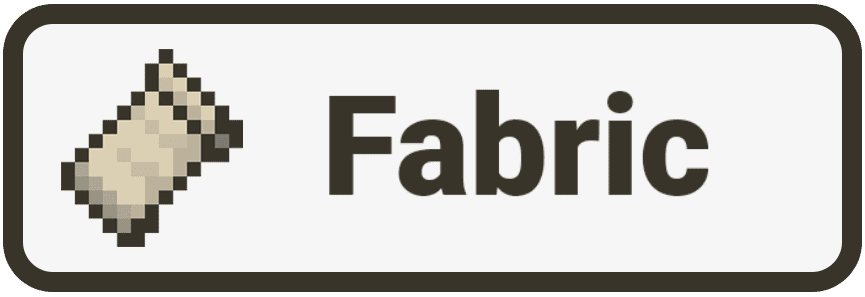

<p align="center">
  
</p>

<div align="center">

# Hey, I'm Tawso

### Backend learner - Java enjoyer - Minecraft modding curious

`learning by building` - `clean code mindset` - `systems over shortcuts`

</div>

---

## ./about

I'm a beginner backend developer building a strong foundation in server-side development.
Right now I'm leveling up through Java Core, OOP, REST APIs, databases, Linux, Docker, and project structure.

My goal is simple: understand how things actually work under the hood and turn that knowledge into useful projects.

```txt
status      learning backend step by step
main stack  Java - Go - Rust - Kotlin - Python
focus       APIs - SQL - Linux - Docker - architecture
vibe        quiet terminal, sharp commits, useful builds
```

---

## ./stack

<p align="center">
  
</p>

---

## ./current-focus

```txt
Backend Development
+-- Java Core
+-- Object-Oriented Programming
+-- REST API
+-- SQL / PostgreSQL
+-- Git & GitHub
+-- Linux Basics
+-- Docker
`-- Clean Architecture
```

---

## ./vibecoder-mode

```java
public class Tawso {
    private final String role = "Backend Developer in progress";
    private final String[] learning = {"Java", "Go", "Rust", "Kotlin", "Python"};

    public void build() {
        while (true) {
            learn();
            shipSmallProjects();
            refactorWithTaste();
        }
    }
}
```

---

## ./modding-corner

<p align="center">
  
  &nbsp;&nbsp;
  
  &nbsp;&nbsp;
  
</p>

```txt
Minecraft modding interest:
Fabric - Forge - Java - backend-minded systems
```

---

<p align="center">
  
</p>

<p align="center">
  
</p>
